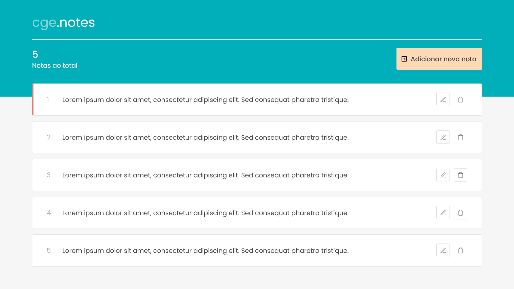

## cge.notes

  <a href="#sobre">Sobre</a>&nbsp;&nbsp;&nbsp;|&nbsp;&nbsp;&nbsp;
  <a href="#funcionalidades">Funcionalidades</a>&nbsp;&nbsp;&nbsp;|&nbsp;&nbsp;&nbsp;
  <a href="#layout-da-aplicação">Layout da aplicação</a>

### Sobre
O **cge.notes** é uma aplicação para você anotar tudo o que estiver pensando. Anote seus pensamentos, crie histórias inspiradoras e emocionantes! 

### Funcionalidades
- [ ] O usuário pode criar uma nota
- [ ] O usuário pode editar uma nota
- [ ] O usuário pode excluir uma nota
- [ ] Os registros devem ser armazenados em um banco de dados

### Layout da aplicação
Para te ajudar nesse desafio, criamos para você a página de listagem das notas.

*Esta é uma sugestão de layout, caso ache necessário, você pode usar sua criatividade para criar um novo layout :wink:*

---

Feito com :heart: by Diretoria de Tecnologia da Informação e Comunicação

  Controladoria-Geral do Estado de Minas Gerais

